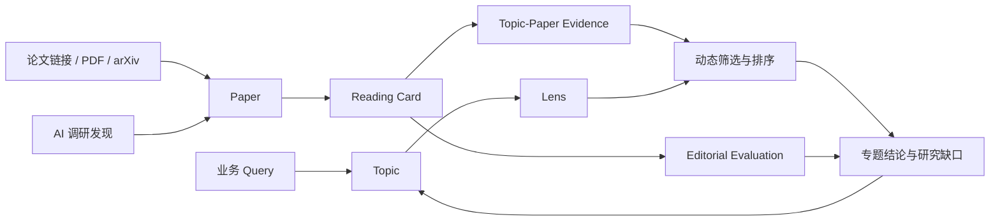
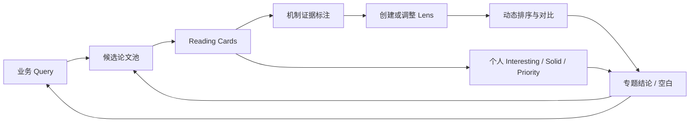

# Research Workspace Model

这个项目把研究工作拆成可独立演化的对象，而不是把“论文摘要、业务筛选、个人偏好”压缩成一个总分。

> **Paper 是证据源；Reading Card 是结构化解读；Topic 是业务问题；Lens 是任务筛选视角；Editorial Evaluation 是个人研究判断。**



## 1. Paper：全局唯一的论文记录

`Paper` 只描述论文身份，不携带某个业务专题的结论。

| 字段             | 含义                             |
| ---------------- | -------------------------------- |
| `title`          | 论文标题                         |
| `source_url`     | arXiv、DOI、会议页或公开全文链接 |
| `authors`        | 作者信息                         |
| `venue` / `year` | 发表信息                         |
| `code_url`       | 可选代码链接                     |

同一篇论文可以进入多个 Topic，但不应复制多份论文事实。

## 2. Reading Card：证据化论文解读

Reading Card 回答“论文原文主张和证据是什么”。默认结构为：

- Motivation
- Method
- Experimental Setup
- Results
- Ablation / Robustness
- Sensitivity / Boundary Conditions
- Limitations
- Takeaways
- Citation

其中 **Results 必须区分原文可核验事实与解释**。`Sensitivity` 可以记录超参数、规模、任务、Reward 数量、训练阶段或分布变化的敏感性；如果论文没有报告，应写“未报告”，而不是猜测“没有”。

## 3. Topic：持续演化的业务问题

每次业务 Query 可以创建一个 Topic；Topic 不是一次性的搜索结果，而是可以不断补充论文、调整范围和保存当前结论的研究工作台。

```yaml
workspace_schema: topic-v1
title: "Topic 示例：让某类方法更可比较、可落地与可复现"
original_query: >
  哪些公开论文能帮助回答当前研究问题，
  以及它们的证据质量、成本和适用边界分别是什么？
scope:
  - direct mechanisms
  - evaluation evidence
  - deployment constraints
exclusions:
  - 只共享关键词、但机制或证据不能迁移到当前问题的工作
status: evolving
```

一个 Topic 的页面应包含：问题重述、范围 / 排除项、机制地图、当前 Lens、逐篇入口、当前结论、证据空白和下一轮研究问题。

## 4. Topic-Paper Evidence：论文在当前问题里的意义

同一篇 Paper 在不同 Topic 中的意义不同。因此，机制标签必须携带证据、置信度和“未知”状态，而不是只写一个不可追溯标签。

```yaml
paper_topic_evidence:
  reward_aggregation:
    value: dynamic-linear-weighting
    evidence: "方法第 3 节：按 batch 统计量调整各 reward 权重"
    confidence: high
  scale_handling:
    value: coefficient-of-variation
    evidence: "公式 4 与 equal-weight 消融"
    confidence: high
  gradient_conflict:
    value: unknown
    evidence: "当前可获得版本未报告逐目标梯度或投影机制"
    confidence: low
```

规则：

- `unknown` 不等于 `false`；
- `not-explicitly-addressed` 应附带阅读依据；
- 标签服务于当前 Topic，不声明论文的全部学术属性；
- 后续读到附录、代码或新版本时，可以更新证据而不重写整个 Reading Card。

## 5. Lens：可保存、可重算的任务筛选视角

Lens 回答“在**当前任务**中，我要找什么”。它不是全局论文总分。

```yaml
lens_schema: lens-v1
name: "梯度冲突优先"
required:
  - field: gradient_conflict
    values: [explicit]
preferred:
  - field: reward_aggregation
    values: [pareto, constrained, policy-combination]
weights:
  gradient_conflict: 5
  scale_handling: 3
  experimental_coverage: 3
  ablation_quality: 2
  engineering_cost: 1
unknown_policy: show-with-warning
```

Lens 生成的榜单必须展示：

1. 当前使用的筛选条件和权重；
2. 每篇论文的逐项得分依据；
3. 未知字段如何处理；
4. 排序时间或版本。

同一 Topic 可有多个 Lens，例如“低侵入落地”“安全约束优先”“梯度冲突优先”“证据优先”。Lens 之间的结果不能合并为一个所谓客观总榜。

## 6. Editorial Evaluation：个人判断不与筛选分混算

个人评价回答“我值得投入多少注意力”，至少保留两个独立维度：

```yaml
editorial_schema: editorial-evaluation-v1
interesting: 5
solid: 2
personal_priority: 1
status: follow-up
note: "方向新，但当前只在小规模设置验证；等待更大规模复现。"
```

| 字段                | 含义                                                        |
| ------------------- | ----------------------------------------------------------- |
| `interesting`       | 新颖性、启发性、改变研究路径的可能性                        |
| `solid`             | 问题定义、方法闭环、实验覆盖、消融和结论边界                |
| `personal_priority` | 人工决定的阅读 / 复现顺序，不由公式强制生成                 |
| `status`            | `to-read`、`deep-read`、`reproduce`、`watch`、`rejected` 等 |

推荐用 Interesting × Solid 二维图和个人队列展示它们，而不是相加成“最终分”。

## 7. 非线性研究循环

研究不是审批流。任何阶段都可以回流：补论文、改范围、添加 Lens、更新证据或改变个人优先级。



本项目的自动化应帮助维护证据、模板和可重算视角；它不应把探索性研究强行变成到处卡住的判断节点。
