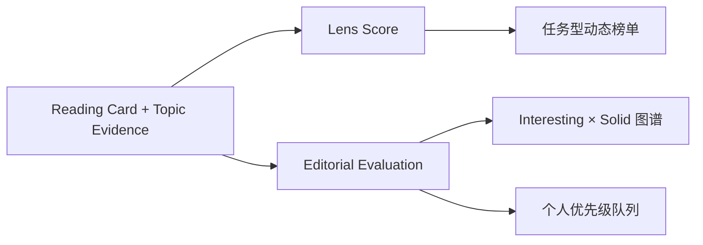

# Scoring and Ranking

这个项目刻意不创建“论文唯一总分”。至少有两类彼此独立的评价：**任务型筛选**与**个人编辑判断**。



## 1. Lens Score：为当前任务筛选

Lens Score 回答：

> 这篇论文是否直接提供了当前业务需要的机制？

它由 Topic 所有者定义。AI 可以给出候选维度、默认权重和依据，但不应替代人的业务判断。

### 示例维度

| 维度     | 可能标签                                                    |
| -------- | ----------------------------------------------------------- |
| 机制相关 | direct、adjacent、diagnostic、keyword-only、unknown         |
| 证据质量 | replicated、ablation、single-benchmark、case-study、unknown |
| 成本     | low、medium、high、not-reported、unknown                    |
| 鲁棒性   | multi-setting、limited-setting、sensitivity-tested、unknown |
| 数据要求 | public-data、private-data、synthetic-data、not-reported     |
| 适用边界 | clearly-stated、partially-stated、not-discussed、unknown    |

Lens 可将这些标签转换为筛选条件和权重，但必须公开计算口径。例如：

```yaml
name: "证据优先"
required:
  - field: mechanism_relevance
    values: [direct]
weights:
  evidence_quality: 5
  robustness: 3
  cost_reporting: 2
  data_availability: 2
unknown_policy: show-with-warning
```

### 解释义务

每个 Lens 榜单必须能回答：

- 为什么这篇论文得到这个分数？
- 哪些字段是论文明确报告的？
- 哪些字段目前未知？
- 未知字段是扣分、保留显示，还是不参与排序？
- 当前排序来自哪一版 Lens？

`unknown` 绝不能静默地按 `false` 或 0 分处理。

## 2. Editorial Evaluation：个人研究判断

个人判断不应与 Lens Score 相加。推荐最小字段：

| 字段              | 范围     | 含义                                                        |
| ----------------- | -------- | ----------------------------------------------------------- |
| Interesting       | 1–5      | 新颖性、启发性、可能改变研究路线的程度                      |
| Solid             | 1–5      | 问题定义、方法闭环、实验覆盖、对照、消融和结论边界          |
| Personal Priority | 人工序列 | 下一步投入注意力的顺序                                      |
| Status            | 标签     | `to-read`、`deep-read`、`reproduce`、`watch`、`rejected` 等 |

典型的四种组合：

| Interesting | Solid | 合理动作                           |
| ----------: | ----: | ---------------------------------- |
|          高 |    高 | 优先深读、复现或纳入方案           |
|          高 |    低 | 跟踪方向；主动找失败模式与复现证据 |
|          低 |    高 | 作为稳健基线、综述依据或工程参考   |
|          低 |    低 | 暂不投入，但保留检索记录与拒绝理由 |

这些不是硬规则。个人优先级始终允许覆盖二维分数。

## 3. 旧式星级的兼容方式

既有内容可以继续使用：

- `business_fit`：当前业务下的 0–5 星主观契合度；0 表示尚未评价；
- `paper_solidity`：当前编辑判断的 0–5 星扎实程度；0 表示尚未评价；
- 专题专项分：某组固定机制的覆盖度。

新模型建议逐步迁移：

| 旧字段           | 新模型位置                                            |
| ---------------- | ----------------------------------------------------- |
| `business_fit`   | 某个默认 Lens 或 Editorial 备注，不再充当全局排序依据 |
| `paper_solidity` | Editorial Evaluation 的 `solid`                       |
| 专项分           | 一个可保存 Lens 的明确标签与权重                      |

迁移不是强制重写历史内容：旧专题可继续展示现有星级；新专题优先记录 Lens 配置、证据标签和独立的 Interesting / Solid。

## 4. 评分伦理与边界

- 分数表达当前使用者和当前业务的判断，不代表论文客观价值。
- 不使用引用数、作者机构或模型规模替代证据质量。
- 论文未报告，不等于方法不存在；应标注未知和查证状态。
- 综述、理论、数据集和系统论文应按其贡献评价，不能被实验论文模板机械惩罚。
- 当业务约束变化、出现新版本或完成复现时，应允许更新分数、Lens 和排序，并保留修改理由。
