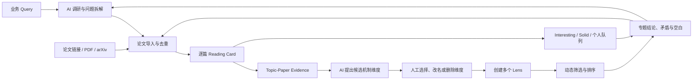

# Research Workflow

本工作流支持两条平等入口：从业务问题开始，或从已经收集的论文链接开始。它们会在 Reading Card 与 Topic 工作台会合。



## 1. 从业务 Query 开始

输入一个开放的业务问题，例如：

> 如何让多个 Reward 信号更可比较、更可聚合，并避免尺度、梯度和优化速度差异导致目标支配？

AI 的第一轮输出应当是**研究空间**，而不是伪装成确定答案的单一方案：

1. 重述问题，并列出可能的多种含义；
2. 给出范围、排除项和检索关键词；
3. 提出可选机制维度；
4. 找到候选论文，并标记每篇与问题的初步关系；
5. 指出当前证据的缺口和容易混淆的概念。

人工可以直接修改范围，也可以跳过 AI 检索而导入已有论文。

## 2. 从论文链接开始

导入 DOI、arXiv、会议页、公开 PDF 或已有书目列表后：

1. 去重并补齐元数据；
2. 检查公开来源是否可访问；
3. 为每篇论文建立或更新 Reading Card；
4. 从已有论文池反向归纳候选机制维度；
5. 决定是否需要再做一轮扩展检索。

不要求先拥有完美 Query。论文池本身可以帮助形成或细化 Topic。

## 3. 建立 Reading Card

每篇论文先做事实层，至少包含：

- Motivation
- Method
- Experimental Setup
- Results
- Ablation / Robustness
- Sensitivity / Boundary Conditions
- Limitations
- Takeaways
- Citation

操作原则：

- 阅读完整相关章节；不能只靠摘要补写实验结论。
- 数字、对照、样本量和统计显著性应可回溯到原文。
- 未报告的内容写“未报告”；不把缺失信息改写为否定性结论。
- 将“论文结果”与“对当前 Topic 的解释”区分开。
- 理论、综述、数据集、系统论文不必伪装成同一种实验论文；应说明其证据形式。

## 4. 标注 Topic-Paper Evidence

论文解读完成后，才在当前 Topic 中标注它究竟覆盖哪些机制、证据在哪、确定性如何。

例如一个 Topic 的候选维度可以包括：

- 与问题的直接相关性；
- 核心机制是否可迁移；
- 证据质量与复现情况；
- 实验设置覆盖范围；
- 数据、计算和工程成本；
- 安全、隐私或版权约束；
- 适用边界是否清楚；
- 未报告字段和证据空白。

AI 可以提出这些维度和初步标签；人工拥有命名、删除、补充、纠正和重新分类的最终控制权。

## 5. 创建 Lens，而非固定总榜

一个 Lens 是一次任务筛选。它保存条件、权重和未知信息的处理方式。

```yaml
name: "低侵入 Reward 聚合"
required:
  - field: engineering_cost
    values: [low]
preferred:
  - field: scale_handling
    values: [normalization, calibration]
weights:
  dynamic_weighting: 4
  scale_handling: 3
  ablation_quality: 2
unknown_policy: show-with-warning
```

建议保留多个 Lens，而不是反复覆盖一个榜单：

- 动态聚合优先；
- 梯度冲突优先；
- 低工程侵入落地；
- 安全约束优先；
- 证据 / 复现优先。

动态榜单需要可解释：每篇的得分来源、缺失信息、筛选条件与权重都应可见。

## 6. 独立维护个人编辑台

筛选得分与个人判断是不同系统。

- **Lens Score**：这篇工作是否具备当前任务需要的机制？
- **Interesting**：它是否新颖、有启发、可能改变研究路线？
- **Solid**：它的论证、实验、消融和结论边界是否可靠？
- **Personal Priority**：你下一步要读、复现或跟踪什么？

不要将 Interesting 与 Solid 强行相加。使用二维图、状态标签和人工优先级队列更符合真实研究决策。

## 7. 形成专题结论，并继续扩充

专题结论应回答：

1. 哪些机制有较强证据？
2. 哪些方法只是在相同术语下解决不同问题？
3. 哪些关键主张没有直接实证支持？
4. 哪些机制组合尚未被充分研究？
5. 下一轮该搜索什么、深读什么或复现什么？

任何结论都可以因新增论文、附录阅读、Lens 修改或个人目标变化而更新。Topic 是版本化工作台，不是一次发布后不能改变的结论。
